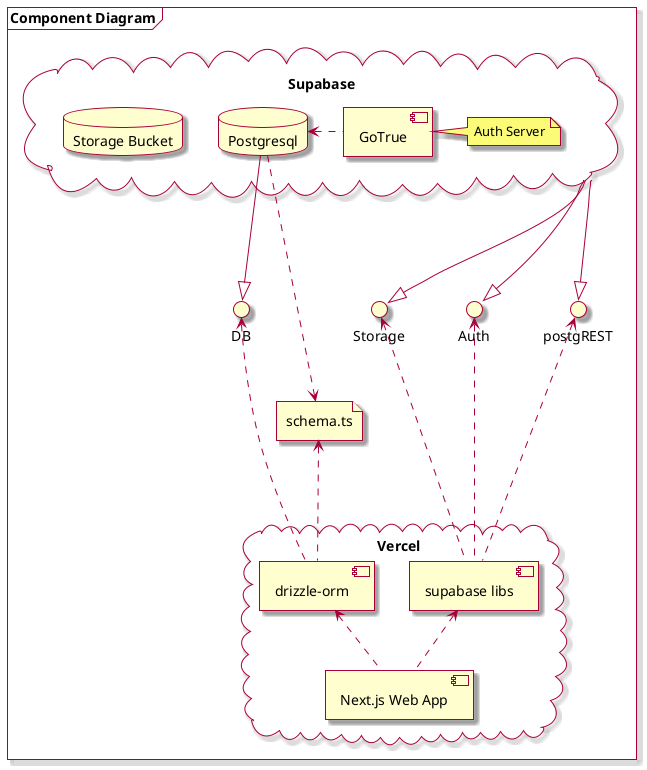

# Architecture Overview
here is how the next app communicates with supabase:


for using the underlying database, everything is managed via `drizzle-orm` and `drizzle-kit

## Environment Setup
the schema is located in `src/db/schema.ts` and connection is defined at `src/db/index.ts`
for the connection to work, add in the necessary env variable in `.env`
```sh
# ...
DATABASE_URL=postgresql://
```

go to the supabase dashboard -> the project -> press "connect" in the upper right corner -> head to "ORMs" section -> select "drizzle" and copy paste the url
after, you should add the password in the url string. ask me for the password.

## Schema Changes Migrations
***DO NOT USE THE WEB STUDIO FOR CREATING OR ALTERING TABLES!!!!***
the schema is managed under `src/db/schema.ts`
how to make a change:
1. edit the file
2. run `drizzle-kit generate`. this adds new migrations under `supabase/`
3. run `drizzle-kit migrate`. this applies migrations to the supabase instance.

p.s.1 if something does not work try `supabase push`. regardless if this worked or not, do:
	1. `rm -r supabase/`
	2.  generate and migrate again

p.s.2 if something still does not work, text me.