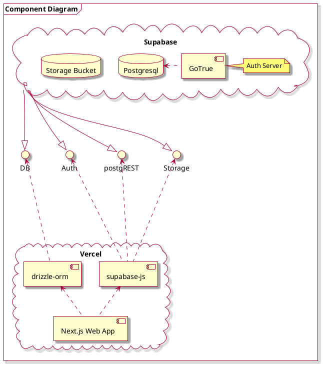
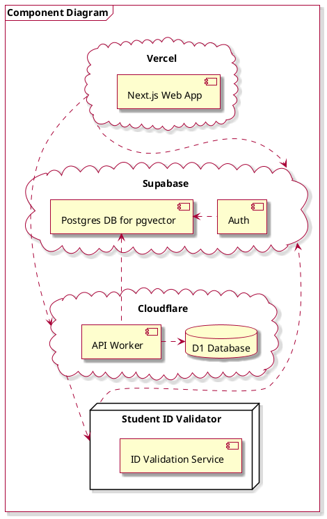
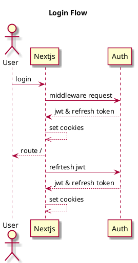
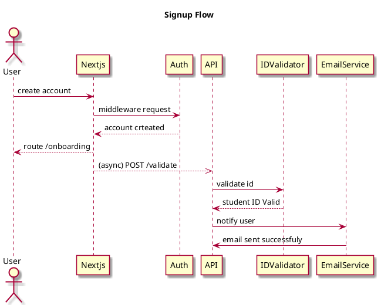

# Braindump

## Architecture 
### Component Diagrams

This is a simplified version that uses Supabase for everything.

This version uses a multi-cloud architecture with next.js on vercel for the frontend, supabase for auth and postgres/pgvector database, and cloudflare for edge computing with d1 database and api workers. A separate student id validation service handles user verification. The design prioritizes performance through edge distribution, industry standard and scalable, and vector search capabilities for content recommendations.
### Sequence Diagrams
Some poorly done auth diagrams

